# Master World Map — Single Source of Truth

> **Game**: *Ruins & the Wandering Ghost*  
> **Master Version**: `1.1.0`  
> **Target Framework**: Three.js Modular Engine  

---

## 1. Overview & Spatial Layout

The world of *Ruins & the Wandering Ghost* is structured into discrete **Regions**, **Locations**, and **Connecting Paths**. All coordinates use standard Right-Handed Three.js World Coordinates (`+X` East, `-X` West, `+Y` Up, `+Z` South, `-Z` North).

### 2D Spatial Map Diagram

```text
                           [NORTH (-Z)]
                                 │
                   (LOC_004) LOC_004_WELL (-15, 0, -30)
                         │       │
      (LOC_003) ─────────┘       └─────── (LOC_005) LOC_005_STONE_GARDEN (5, 0, -30)
  LOC_003_EMPTY_HOUSE                              │
      (-10, 0, -18)                                │
            │                                      │
  (LOC_002) LOC_002_FORGOTTEN_PATH (2, 0, -15)     (LOC_006) LOC_006_STATUE (15, 0, -25)
            │                                      │
  [WEST (-X)] ─────────────────────────────────────┼──────────────────────────────────── [EAST (+X)]
            │                                      │
  (LOC_001) LOC_001_ARCHWAY (2, 0, -1)             (LOC_007) LOC_007_BROKEN_TOWER (20, 0, -5)
      [START / ORIGIN (0,0,0)]                     │
                                                   │
                                         (LOC_008) LOC_008_SILENT_BELL (30, 0, 5)
                                                   │
                                         (LOC_009) LOC_009_OLD_ROAD (20, 0, 20)
                                                   │
                                         (LOC_010) LOC_010_GRAVE (10, 0, 30)
                                 │
                           [SOUTH (+Z)]
```

---

## 2. Exhaustive Location Specifications

---

### `LOC_001_ARCHWAY`

- **LOCATION ID**: `LOC_001_ARCHWAY`
- **NAME**: The Archway
- **REGION**: `REG_001_FORGOTTEN_SETTLEMENT`
- **CHAPTER**: 1
- **POSITION**: `Vector3(2.0, 0.0, -1.0)`
- **SIZE**: `(4.0m, 2.0m)`
- **ELEVATION**: `0.0m`
- **NEIGHBORING LOCATIONS**: `["LOC_002_FORGOTTEN_PATH"]`
- **LANDMARKS**: Dual coursed stone pillars, broken overhead keystone arch, stone foundation footprint, creeping ivy vines
- **NPCs**: `[]`
- **INTERACTIONS**: `["INT_001_ARCHWAY"]`
- **MEMORIES**: `["MEM_001_ARCHWAY"]`
- **SECRETS**: `[]`
- **PUZZLES**: Initial inspect trigger teaching spatial interaction `[E]`
- **REQUIRED ABILITIES**: `["Float"]`
- **UNLOCKED ABILITIES**: `["Inspect"]`
- **STORY EVENTS**: `["EVT_001_ARCHWAY"]` *(Spawns glowing magenta point light)*
- **REALITY STATE**: Weathered grey stone pillars surrounded by overgrown grass and fallen chips
- **MEMORY STATE**: Soft violet particle aura hovering around the broken keystone
- **TRUTH STATE**: This archway was the formal entrance to the ancient settlement before the valley flooded
- **ATMOSPHERE**: Heavy fog (`density: 0.025`), cold blue lighting (`#5577aa`)
- **AUDIO**: `WIND_WHISPER`
- **IMPLEMENTATION STATUS**: `ACTIVE_IMPLEMENTED`

---

### `LOC_002_FORGOTTEN_PATH`

- **LOCATION ID**: `LOC_002_FORGOTTEN_PATH`
- **NAME**: The Forgotten Path
- **REGION**: `REG_001_FORGOTTEN_SETTLEMENT`
- **CHAPTER**: 1
- **POSITION**: `Vector3(2.0, 0.0, -15.0)`
- **SIZE**: `(6.0m, 12.0m)`
- **ELEVATION**: `0.0m`
- **NEIGHBORING LOCATIONS**: `["LOC_001_ARCHWAY", "LOC_003_EMPTY_HOUSE"]`
- **LANDMARKS**: Dead branching trees, worn gravel desire path, buried rusted pendant
- **NPCs**: `[]`
- **INTERACTIONS**: `["INT_002_PATH"]`
- **MEMORIES**: `["MEM_002_PATH"]`
- **SECRETS**: `[]`
- **PUZZLES**: Dirt digging interaction at path bend
- **REQUIRED ABILITIES**: `["Float", "Inspect"]`
- **UNLOCKED ABILITIES**: `[]`
- **STORY EVENTS**: `["EVT_002_PATH"]` *(Spawns toast: "Holding it produces a strange warmth.")*
- **REALITY STATE**: Dry mud path flanked by dead tree trunks and leaf litter
- **MEMORY STATE**: Golden trail particles indicating the ancient stream flow
- **TRUTH STATE**: The path ran parallel to an irrigation canal that sustained the village crops
- **ATMOSPHERE**: Medium fog, rustling leaf ambient background
- **AUDIO**: `RUSTLING_LEAVES`
- **IMPLEMENTATION STATUS**: `ACTIVE_IMPLEMENTED`

---

### `LOC_003_EMPTY_HOUSE`

- **LOCATION ID**: `LOC_003_EMPTY_HOUSE`
- **NAME**: The Empty House
- **REGION**: `REG_001_FORGOTTEN_SETTLEMENT`
- **CHAPTER**: 1
- **POSITION**: `Vector3(-10.0, 0.0, -18.0)`
- **SIZE**: `(6.0m, 6.0m)`
- **ELEVATION**: `0.0m`
- **NEIGHBORING LOCATIONS**: `["LOC_002_FORGOTTEN_PATH", "LOC_004_WELL"]`
- **LANDMARKS**: Coursed stone wall perimeter with doorway gap, stone fireplace hearth, fallen wooden ceiling beams, rubble piles
- **NPCs**: `["NPC_002_WOMAN"]` *(Spectral Echo)*
- **INTERACTIONS**: `["INT_003_HOUSE"]`
- **MEMORIES**: `["MEM_003_HOUSE"]`
- **SECRETS**: `["SEC_001_WALL_NICHE"]`
- **PUZZLES**: Scratched stone inscription reading
- **REQUIRED ABILITIES**: `["Float", "Inspect"]`
- **UNLOCKED ABILITIES**: `[]`
- **STORY EVENTS**: `["EVT_003_HOUSE"]`
- **REALITY STATE**: Ruined homestead with collapsed roof and ash-stained fireplace
- **MEMORY STATE**: Warm orange fireplace glow and phantom rocking chair outline
- **TRUTH STATE**: The weaver's cottage where family names were preserved in stone
- **ATMOSPHERE**: Light fog, warm ember hearth lighting (`#ffaa44`)
- **AUDIO**: `SETTLING_STONE`
- **IMPLEMENTATION STATUS**: `ACTIVE_IMPLEMENTED`

---

### `LOC_004_WELL`

- **LOCATION ID**: `LOC_004_WELL`
- **NAME**: The Old Well
- **REGION**: `REG_001_FORGOTTEN_SETTLEMENT`
- **CHAPTER**: 1
- **POSITION**: `Vector3(-15.0, 0.0, -30.0)`
- **SIZE**: `(6.0m, 6.0m)`
- **ELEVATION**: `0.0m`
- **NEIGHBORING LOCATIONS**: `["LOC_003_EMPTY_HOUSE", "LOC_005_STONE_GARDEN"]`
- **LANDMARKS**: Circular stone block well ring, wooden gantry posts, tilted crossbeam, floor slabs, storage debris
- **NPCs**: `[]`
- **INTERACTIONS**: `["INT_004_WELL"]`
- **MEMORIES**: `["MEM_004_WELL"]`
- **SECRETS**: `[]`
- **PUZZLES**: Looking into deep water triggering dark memory flashback
- **REQUIRED ABILITIES**: `["Float", "Inspect"]`
- **UNLOCKED ABILITIES**: `[]`
- **STORY EVENTS**: `["EVT_004_WELL"]` *(Spawns deep blue point light & toast)*
- **REALITY STATE**: Mossy well filled with pitch-black still water
- **MEMORY STATE**: Deep teal ripples and falling bucket animation
- **TRUTH STATE**: The well was the village's primary source of water until it turned dark during the calamity
- **ATMOSPHERE**: Dense fog, deep teal lighting (`#6fa8ff`)
- **AUDIO**: `WATER_DRIPS`
- **IMPLEMENTATION STATUS**: `ACTIVE_IMPLEMENTED`

---

### `LOC_005_STONE_GARDEN`

- **LOCATION ID**: `LOC_005_STONE_GARDEN`
- **NAME**: The Stone Garden
- **REGION**: `REG_001_FORGOTTEN_SETTLEMENT`
- **CHAPTER**: 1
- **POSITION**: `Vector3(5.0, 0.0, -30.0)`
- **SIZE**: `(9.0m, 9.0m)`
- **ELEVATION**: `0.0m`
- **NEIGHBORING LOCATIONS**: `["LOC_004_WELL", "LOC_006_STATUE"]`
- **LANDMARKS**: Octagonal fountain base, jagged central stone fountain core, 4 cardinal stone benches, memory flower object
- **NPCs**: `["NPC_001_CHILD"]` *(Spectral Echo)*
- **INTERACTIONS**: `["INT_005_GARDEN"]`
- **MEMORIES**: `["MEM_005_GARDEN"]`
- **SECRETS**: `["SEC_002_CARVED_SLATE"]`
- **PUZZLES**: Unlocking Memory Sense (Q) at the fountain bench
- **REQUIRED ABILITIES**: `["Float", "Inspect"]`
- **UNLOCKED ABILITIES**: `["Memory Sense (Q)"]`
- **STORY EVENTS**: `["EVT_005_GARDEN"]`
- **REALITY STATE**: Dry fountain bowl surrounded by cracked mossy benches
- **MEMORY STATE**: Floating bioluminescent memory lilies and phantom fountain water spray
- **TRUTH STATE**: The central communal garden where children gathered before the exodus
- **ATMOSPHERE**: Light fog, pale violet lighting (`#ffaae0`)
- **AUDIO**: `CHIME_WIND`
- **IMPLEMENTATION STATUS**: `ACTIVE_IMPLEMENTED`

---

### `LOC_006_STATUE`

- **LOCATION ID**: `LOC_006_STATUE`
- **NAME**: The Weathered Statue
- **REGION**: `REG_001_FORGOTTEN_SETTLEMENT`
- **CHAPTER**: 1
- **POSITION**: `Vector3(15.0, 0.0, -25.0)`
- **SIZE**: `(5.0m, 5.0m)`
- **ELEVATION**: `0.0m`
- **NEIGHBORING LOCATIONS**: `["LOC_005_STONE_GARDEN", "LOC_007_BROKEN_TOWER"]`
- **LANDMARKS**: Square plinth base, carved stone torso, raised arm cylinder, surrounding low boundary walls, hidden memory echo cone
- **NPCs**: `[]`
- **INTERACTIONS**: `["INT_006_STATUE"]`
- **MEMORIES**: `["MEM_006_STATUE"]`
- **SECRETS**: `[]`
- **PUZZLES**: Requiring Memory Sense (Q) active to see and touch the statue's spectral echo
- **REQUIRED ABILITIES**: `["Float", "Inspect", "Memory Sense (Q)"]`
- **UNLOCKED ABILITIES**: `[]`
- **STORY EVENTS**: `["EVT_006_STATUE"]`
- **REALITY STATE**: Headless weathered statue pointing eastward
- **MEMORY STATE**: Intact wireframe silhouette of guardian statue glowing amber
- **TRUTH STATE**: A statue dedicated to the founder who pointed toward safety across the eastern hills
- **ATMOSPHERE**: Medium fog, cold blue lighting
- **AUDIO**: `RESONANT_HUM`
- **IMPLEMENTATION STATUS**: `ACTIVE_IMPLEMENTED`

---

### `LOC_007_BROKEN_TOWER`

- **LOCATION ID**: `LOC_007_BROKEN_TOWER`
- **NAME**: The Broken Tower
- **REGION**: `REG_001_FORGOTTEN_SETTLEMENT`
- **CHAPTER**: 1
- **POSITION**: `Vector3(20.0, 0.0, -5.0)`
- **SIZE**: `(8.4m, 8.4m)`
- **ELEVATION**: `0.0m`
- **NEIGHBORING LOCATIONS**: `["LOC_006_STATUE", "LOC_008_SILENT_BELL"]`
- **LANDMARKS**: Circular foundation footprint, curved 10-segment wall arc, 35 scattered collapsed tower block meshes, ivy vines
- **NPCs**: `[]`
- **INTERACTIONS**: `["INT_007_TOWER"]`
- **MEMORIES**: `["MEM_007_TOWER"]`
- **SECRETS**: `["SEC_003_FOUNDATION_VAULT"]`
- **PUZZLES**: Inspecting carved warning inscription on fallen block mound
- **REQUIRED ABILITIES**: `["Float", "Inspect"]`
- **UNLOCKED ABILITIES**: `[]`
- **STORY EVENTS**: `["EVT_007_TOWER"]`
- **REALITY STATE**: Mass of shattered stone blocks around a truncated curved wall base
- **MEMORY STATE**: Phantom tower silhouette reaching 20 meters into the sky
- **TRUTH STATE**: The watchtower that collapsed during the final siege
- **ATMOSPHERE**: Heavy fog, storm grey lighting (`#667788`)
- **AUDIO**: `HOWLING_WIND`
- **IMPLEMENTATION STATUS**: `ACTIVE_IMPLEMENTED`

---

### `LOC_008_SILENT_BELL`

- **LOCATION ID**: `LOC_008_SILENT_BELL`
- **NAME**: The Silent Bell
- **REGION**: `REG_001_FORGOTTEN_SETTLEMENT`
- **CHAPTER**: 1
- **POSITION**: `Vector3(30.0, 0.0, 5.0)`
- **SIZE**: `(5.0m, 5.0m)`
- **ELEVATION**: `0.0m`
- **NEIGHBORING LOCATIONS**: `["LOC_007_BROKEN_TOWER", "LOC_009_OLD_ROAD"]`
- **LANDMARKS**: Dual wooden gantry posts, overhead beam, dark stone bell mesh, spectral wireframe memory bell, campfire ring
- **NPCs**: `[]`
- **INTERACTIONS**: `["INT_008_BELL"]`
- **MEMORIES**: `["MEM_008_BELL"]`
- **SECRETS**: `[]`
- **PUZZLES**: Requiring Memory Sense (Q) to make the silent bell toll
- **REQUIRED ABILITIES**: `["Float", "Inspect", "Memory Sense (Q)"]`
- **UNLOCKED ABILITIES**: `[]`
- **STORY EVENTS**: `["EVT_008_BELL"]`
- **REALITY STATE**: Heavy bronze/stone bell hanging motionless from a decaying wooden gantry
- **MEMORY STATE**: Wireframe bell vibrating with golden soundwave rings
- **TRUTH STATE**: The bell used to gather villagers for announcements and warnings
- **ATMOSPHERE**: Medium fog, golden dusk lighting (`#ffaa55`)
- **AUDIO**: `DISTANT_CHIME`
- **IMPLEMENTATION STATUS**: `ACTIVE_IMPLEMENTED`

---

### `LOC_009_OLD_ROAD`

- **LOCATION ID**: `LOC_009_OLD_ROAD`
- **NAME**: The Old Road
- **REGION**: `REG_001_FORGOTTEN_SETTLEMENT`
- **CHAPTER**: 1
- **POSITION**: `Vector3(20.0, 0.0, 20.0)`
- **SIZE**: `(5.0m, 15.0m)`
- **ELEVATION**: `0.0m`
- **NEIGHBORING LOCATIONS**: `["LOC_008_SILENT_BELL", "LOC_010_GRAVE"]`
- **LANDMARKS**: 10 cobblestone road slabs, stone road marker post, low boundary walls, broken wooden cart wreck
- **NPCs**: `["NPC_003_WANDERER"]` *(Spectral Echo)*
- **INTERACTIONS**: `["INT_009_ROAD"]`
- **MEMORIES**: `["MEM_009_ROAD"]`
- **SECRETS**: `[]`
- **PUZZLES**: Reading road marker inscription at the path fork
- **REQUIRED ABILITIES**: `["Float", "Inspect"]`
- **UNLOCKED ABILITIES**: `[]`
- **STORY EVENTS**: `["EVT_009_ROAD"]`
- **REALITY STATE**: Sunken stone road leading toward the valley rim, flanked by a broken cart
- **MEMORY STATE**: Phantom wagon tracks glowing pale silver
- **TRUTH STATE**: The main trade road leading out of the settlement to distant lands
- **ATMOSPHERE**: Light fog, pale moon lighting (`#aabbcc`)
- **AUDIO**: `DUST_WHISPER`
- **IMPLEMENTATION STATUS**: `ACTIVE_IMPLEMENTED`

---

### `LOC_010_GRAVE`

- **LOCATION ID**: `LOC_010_GRAVE`
- **NAME**: The Forgotten Grave
- **REGION**: `REG_001_FORGOTTEN_SETTLEMENT`
- **CHAPTER**: 1
- **POSITION**: `Vector3(10.0, 0.0, 30.0)`
- **SIZE**: `(7.0m, 7.0m)`
- **ELEVATION**: `0.0m`
- **NEIGHBORING LOCATIONS**: `["LOC_009_OLD_ROAD"]`
- **LANDMARKS**: Primary tilted headstone, 6 surrounding stone markers, 4 extra grave plots, surrounding low wall, boundary tree
- **NPCs**: `[]`
- **INTERACTIONS**: `["INT_010_GRAVE"]`
- **MEMORIES**: `["MEM_010_GRAVE"]`
- **SECRETS**: `["SEC_004_INSCRIPTION"]`
- **PUZZLES**: Final gravestone interaction completing Chapter 1
- **REQUIRED ABILITIES**: `["Float", "Inspect"]`
- **UNLOCKED ABILITIES**: `["Chapter 1 Mastery"]`
- **STORY EVENTS**: `["EVT_010_GRAVE"]` *(Spawns pale blue point light & Chapter 1 completion toast)*
- **REALITY STATE**: Solitary headstone overgrown with moss under a dark sky
- **MEMORY STATE**: Brilliant pillar of celestial blue light ascending into the stars
- **TRUTH STATE**: The grave of the spirit's former mortal body, marking the origin of their return
- **ATMOSPHERE**: Dense fog, midnight indigo lighting (`#aac4ff`)
- **AUDIO**: `ABSOLUTE_SILENCE`
- **IMPLEMENTATION STATUS**: `ACTIVE_IMPLEMENTED`

---

## 3. Node Graph Connections & Desire Lines

```mermaid
graph TD
    REG_001["REG_001_FORGOTTEN_SETTLEMENT"]
    
    subgraph Chapter_1["Chapter 1 Node Graph"]
        L1["LOC_001_ARCHWAY"] -->|Primary Path| L2["LOC_002_FORGOTTEN_PATH"]
        L2 -->|Primary Path| L3["LOC_003_EMPTY_HOUSE"]
        L3 -->|Primary Path| L4["LOC_004_WELL"]
        L3 -.->|Desire Line| L4
        L4 -->|Primary Path| L5["LOC_005_STONE_GARDEN"]
        L5 -->|Primary Path| L6["LOC_006_STATUE"]
        L5 -.->|Desire Line| L6
        L6 -->|Primary Path| L7["LOC_007_BROKEN_TOWER"]
        L7 -->|Primary Path| L8["LOC_008_SILENT_BELL"]
        L8 -->|Primary Path| L9["LOC_009_OLD_ROAD"]
        L9 -->|Primary Path| L10["LOC_010_GRAVE"]
    end
```



---

## 4. Codebase Reference Map

- **World Registry**: [`src/world/locations/locations.js`](file:///home/qtech/Downloads/timeflo/games/story/ruins-wandering-ghost/src/world/locations/locations.js)
- **Region Registry**: [`src/world/locations/regions.js`](file:///home/qtech/Downloads/timeflo/games/story/ruins-wandering-ghost/src/world/locations/regions.js)
- **Connections**: [`src/world/locations/connections.js`](file:///home/qtech/Downloads/timeflo/games/story/ruins-wandering-ghost/src/world/locations/connections.js)
- **Structure Builders**: [`src/structures/`](file:///home/qtech/Downloads/timeflo/games/story/ruins-wandering-ghost/src/structures/) (`Archway.js`, `EmptyHouse.js`, `Well.js`, `Statue.js`, etc.)
- **Story & Quests**: [`src/story/chapters/Chapter1.js`](file:///home/qtech/Downloads/timeflo/games/story/ruins-wandering-ghost/src/story/chapters/Chapter1.js)
- **Memory Lore**: [`src/story/memories/Chapter1Memories.js`](file:///home/qtech/Downloads/timeflo/games/story/ruins-wandering-ghost/src/story/memories/Chapter1Memories.js)
- **Event Handlers**: [`src/story/events/StoryEvents.js`](file:///home/qtech/Downloads/timeflo/games/story/ruins-wandering-ghost/src/story/events/StoryEvents.js)
